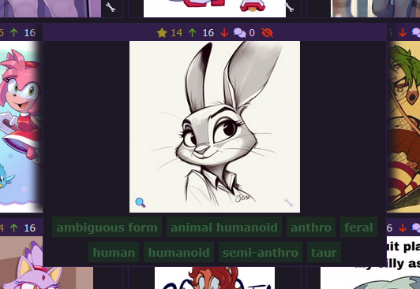
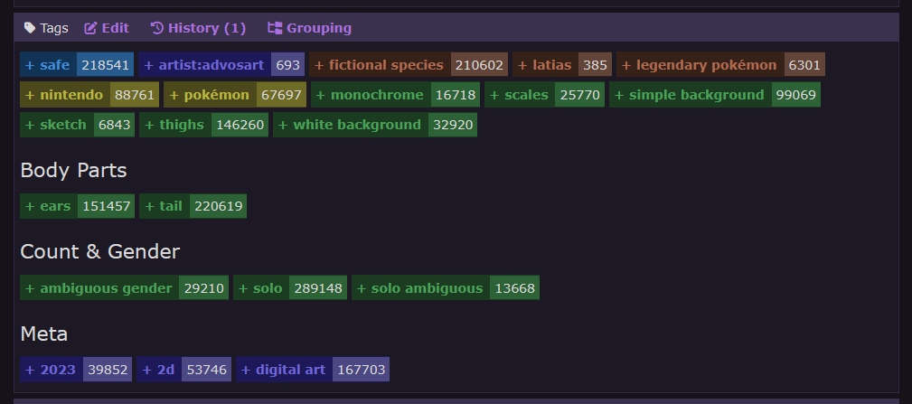
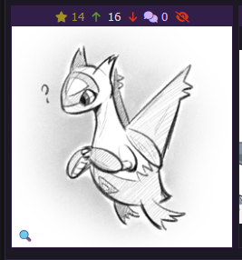
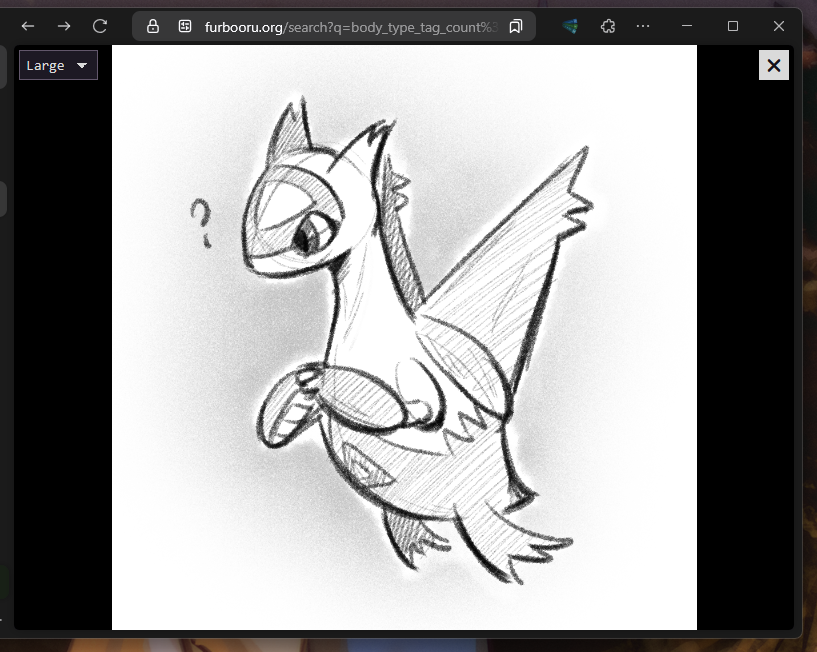

# Philomena Tagging Assistant

This is a browser extension written for the [Furbooru](https://furbooru.org), [Derpibooru](https://derpibooru.org) and
[Tantabus](https://tantabus.ai) image-boards. It gives you the ability to manually go over the list of images and apply 
tags to them without opening each individual image.

## Installation

This extension is available for both Chromium- and Firefox-based browsers. You can find the links to the extension pages
below.

### Furbooru Tagging Assistant

[](https://addons.mozilla.org/en-US/firefox/addon/furbooru-tagging-assistant/)
[](https://chromewebstore.google.com/detail/kpgaphaooaaodgodmnkamhmoedjcnfkj)

### Derpibooru Tagging Assistant

[](https://addons.mozilla.org/en-US/firefox/addon/derpibooru-tagging-assistant/)
[](https://chromewebstore.google.com/detail/pnmbomcdbfcghgmegklfofncfigdielb)

## Features

### Tagging Profiles

Select a set of tags and add/remove them from images without opening them. Just hover over image, click on tags and 
you're done!



### Custom Tag Groups

Customize the list of tags with your own custom tag groups. Apply custom colors to different groups or even separate 
them from each other with group titles.



### Fullscreen Viewer

Open up the specific image or video in fullscreen mode by clicking 🔍 icon in the bottom left corner of the image. This 
feature is opt-in and should be enabled in the settings first.





## Building

Recommendations on environment:

- Recommended version of Node.js: LTS (20)

First you need to clone the repository and install all packages:

```shell
npm install --save-dev
```

Second, you need to run the `build` command. It will first build the popup using SvelteKit and then build all the 
content scripts/stylesheets and copy the manifest afterward.

Extension can currently be built for multiple different imageboards using one of the following commands:

```shell
# Furbooru:
npm run build

# Derpibooru:
npm run build:derpibooru

# Tantabus:
npm run build:tantabus
```

When build is complete, extension  files can be found in the `/build` directory. These files can be either used 
directly in Chrome (via loading the extension as unpacked extension) or manually compressed into `*.zip` file and loaded
into Firefox.
